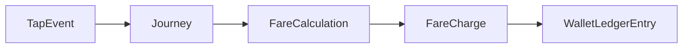

# TransitPay

Prepaid **Account-Based Ticketing (ABT)** for public transport — tap on / tap off, fare engine, wallet ledger, daily cap, and incomplete-journey expiry — with a browser dashboard for demos.

**Status:** v1 complete (Phases 0–8). Node/TypeScript stack only; the legacy Spring Boot prototype has been removed.

```text
Backend:   Node.js + Express + TypeScript, Drizzle ORM, PostgreSQL, node-cron
Frontend:  Vite (vanilla TypeScript MPA), fetch → /api
Testing:   Vitest + Supertest
Deploy:    Docker → ECS Fargate; S3 + CloudFront (see docs)
```

---

## What it does

1. Register / login → transit account, wallet, fare-media token  
2. Top up (mock payment) → append-only ledger  
3. Tap ENTRY / EXIT at validators → journeys  
4. Price completed trips (zone pairs, student discount, daily cap)  
5. Debit wallet atomically with fare charge + ledger entry  
6. Expire open journeys after 4 hours → £5 incomplete penalty  
7. Demo UI: dashboard, tap simulator, journeys, fare breakdown, wallet  

Money is **integer pence** in domain logic; API responses use decimal GBP strings (`"4.00"`).

---

## Quick start

```bash
# 1. Postgres (init script also creates transport_abt + transport_abt_test)
docker compose up -d postgres

# 2. API
cd backend
cp .env.example .env
npm install
npm run db:migrate
npm run db:seed
npm run dev            # http://localhost:3000

# 3. Dashboard
cd ../frontend
npm install
npm run dev            # http://localhost:5173  (proxies /api → :3000)
```

Open http://localhost:5173 and sign in with a demo user below.

```bash
# Tests
cd backend
npm run test:unit    # fare rules — no DB needed
# Full suite (Docker Desktop + postgres must be up):
docker compose up -d postgres   # from repo root
npm test                        # unit + integration (transport_abt_test)
```

---

## Demo credentials

| Email | Password | Media | Notes |
|-------|----------|-------|-------|
| `demo@example.com` | `password123` | `CARD-DEMO-001` | Adult, £20 |
| `student@example.com` | `password123` | `CARD-STUDENT-001` | 50% discount + seed story |
| `staff@example.com` | `password123` | `CARD-STAFF-001` | **STAFF** — can run expire job from Wallet |

**Student seed story** (from `npm run db:seed`):

- £20 via top-up ledger  
- 2 completed Zone 1→2 trips (discounted)  
- 1 OPEN journey ~5h old → sign in as **staff** and use Wallet “Expire stale journeys”, or `POST /api/admin/jobs/expire-journeys` with a STAFF JWT, or `npm run job:expire:dev`

**Sample adult trip:** ENTRY `VAL-CENTRAL-ENTRY-01` → EXIT `VAL-RIVERSIDE-EXIT-01` → fare **£4.00**.

---

## Repository layout

```text
backend/              Express API, domain, Drizzle, jobs, Dockerfile
frontend/             Vite MPA (login, dashboard, tap, journeys, wallet)
docs/API.md           Route + error-code reference
docs/AWS_DEPLOYMENT_GUIDE.md
execution_plans/      Phase plans + audits (0–8 done)
docker-compose.yml    Postgres (+ unused Redis leftover)
ts_payment_overhaul_v1.md
cloud_infrastructure_guide.md
```

### Frontend pages

| Page | Purpose |
|------|---------|
| `/` / `index.html` | Login |
| `register.html` | Register |
| `dashboard.html` | Balance, rider, media, daily cap left |
| `tap.html` | Validator tap simulator |
| `journeys.html` / `journey.html` | History + fare breakdown |
| `wallet.html` | Top-up, ledger, expire job button |

---

## Architecture



| Stage | Question |
|-------|----------|
| TapEvent | What happened at a validator? |
| Journey | What trip did those taps represent? |
| FareCalculation | What should it cost, and why? |
| FareCharge | What does the passenger owe? |
| WalletLedgerEntry | How did stored value change? |
| PaymentTransaction | What external money moved (mock top-up)? |

| Concept | Role |
|---------|------|
| `TransitAccount` + `Wallet` | Passenger identity and stored value |
| `FareMedia` | Card/device token (not the balance) |
| `Zone` → `Station` → `Validator` | Network |
| Fare rules + `CapRule` | Zone pricing, rider discount, £15 daily cap |
| Incomplete job | Open journeys older than 4h → £5 penalty |

**Fare table (v1):** same-zone £2.50 · cross-zone £4.00 · daily cap £15 · incomplete £5 · max journey 4 hours.

---

## Useful scripts (`backend/`)

| Script | Purpose |
|--------|---------|
| `npm run dev` | API with watch + local cron (`ENABLE_CRON`) |
| `npm run build` / `npm start` | Compile → `node dist/server.js` |
| `npm run db:migrate` | Drizzle migrations |
| `npm run db:seed` | Network, rules, demo users, student story |
| `npm test` | Unit then integration (integration needs Postgres) |
| `npm run test:unit` | Fare-engine unit tests only |
| `npm run test:integration` | Supertest flows against `transport_abt_test` |
| `npm run job:expire` | One-off expire (prod / EventBridge image) |
| `npm run job:expire:dev` | Same via `tsx` |

Local cron defaults **on** in development. Production API tasks should set `ENABLE_CRON=false` and run expire via EventBridge → `node dist/jobs/expireIncompleteJourneys.js` (see AWS guide).

Docker:

```bash
cd backend
docker build -t transitpay-api:local .
```

---

## API (summary)

Base: `http://localhost:3000/api` · JWT on account routes · full table in [`docs/API.md`](docs/API.md).

| Area | Endpoints |
|------|-----------|
| Auth | `POST /auth/register`, `POST /auth/login` |
| Account | `GET /account`, `GET /account/cap-status` |
| Wallet | `POST /wallet/topup`, `GET /account/wallet/ledger` |
| Travel | `POST /taps`, `GET /account/journeys`, `.../fare` |
| Demo | `GET /admin/stations`, `POST /admin/jobs/expire-journeys` |
| Health | `GET /health` |

Stable errors include `JOURNEY_ALREADY_OPEN`, `NO_OPEN_JOURNEY`, `INSUFFICIENT_BALANCE`, `MEDIA_BLOCKED`.

---

## Deploy (AWS)

Target shape: **S3 + CloudFront** (UI) · **ALB + ECS Fargate** (API) · **RDS PostgreSQL** · **EventBridge** expire job · **Secrets Manager**.

Step-by-step: [`docs/AWS_DEPLOYMENT_GUIDE.md`](docs/AWS_DEPLOYMENT_GUIDE.md)  
Architecture rationale: [`cloud_infrastructure_guide.md`](cloud_infrastructure_guide.md)

---

## Build history

| Phase | Focus | Status |
|-------|--------|--------|
| 0–2 | Skeleton, account/network, tap & journey | done |
| 3–5 | Fare engine, wallet/ledger, daily cap | done |
| 6 | Incomplete-journey job | done |
| 7 | Frontend dashboard | done |
| 8 | README, seed story, tests, API docs | done |
| S1–S3 | Security hardening (ownership, taps, settlement) | [planned](execution_plans/security_hardening_plan.md) |

Details: [`execution_plans/`](execution_plans/).

---

## Out of v1 scope

Intentional deferrals (not unfinished work):

- Open-loop bank cards  
- Weekly capping / peak fares  
- Journey correction + refunds  
- Stripe (top-up is mock)  
- Debt recovery / SQS workers  

---

## Documents

| Document | Role |
|----------|------|
| [`docs/API.md`](docs/API.md) | Routes & error codes |
| [`docs/AWS_DEPLOYMENT_GUIDE.md`](docs/AWS_DEPLOYMENT_GUIDE.md) | AWS deploy steps |
| [`ts_payment_overhaul_v1.md`](ts_payment_overhaul_v1.md) | Full ABT design |
| [`execution_plans/`](execution_plans/) | Phase plans + audits |
| [`execution_plans/security_hardening_plan.md`](execution_plans/security_hardening_plan.md) | Post-v1 security milestones S1–S3 |
| [`cloud_infrastructure_guide.md`](cloud_infrastructure_guide.md) | AWS architecture |
| [`backend/.env.example`](backend/.env.example) | Env vars including `ENABLE_CRON` |
